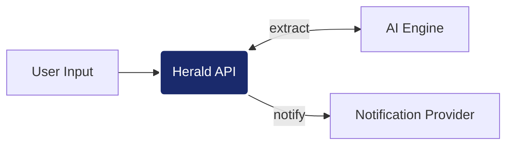
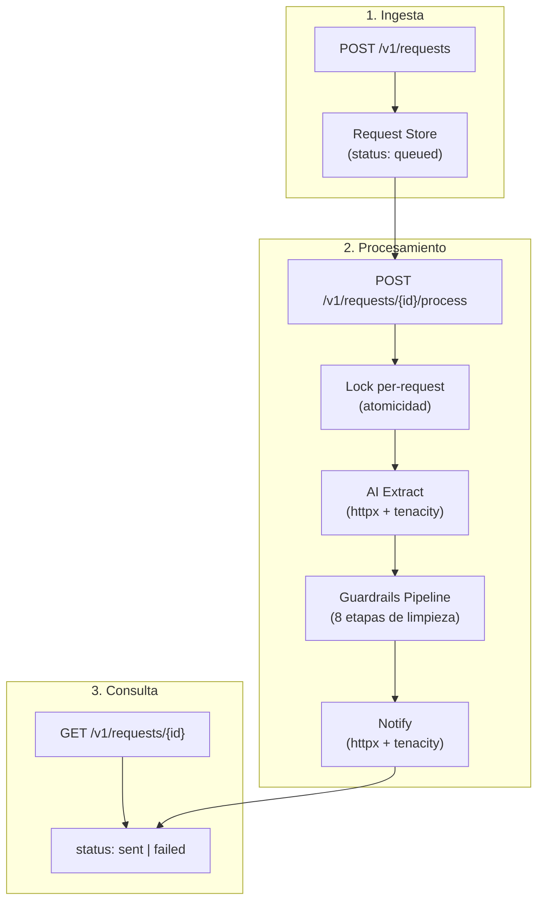
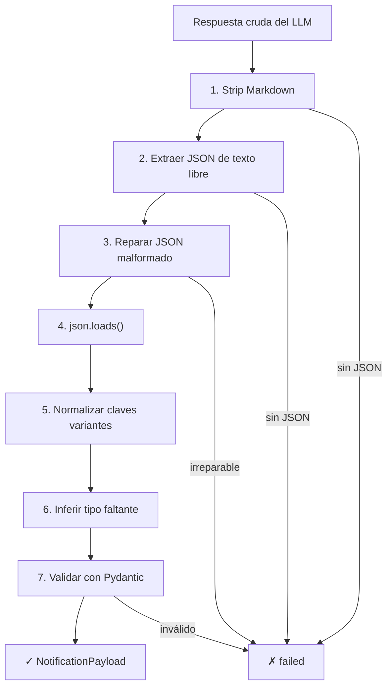
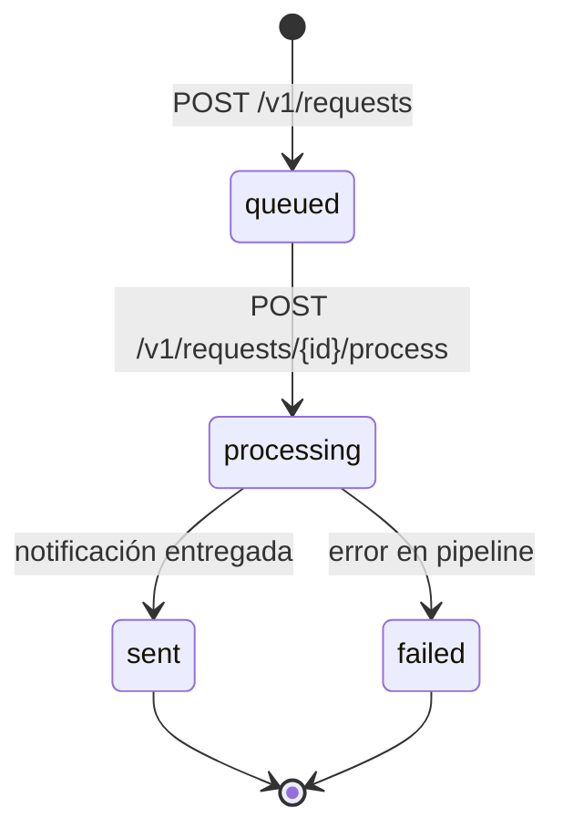

# Herald - Intelligent Notification Service

Herald es un microservicio que recibe instrucciones en lenguaje natural, extrae datos estructurados mediante un motor de IA y coordina el envío de notificaciones (email/SMS). Su diferenciador clave es un pipeline de guardrails robusto diseñado para manejar la naturaleza estocástica de las respuestas de LLMs.



---

## Arquitectura

### Pipeline de Procesamiento

Cada solicitud pasa por un pipeline síncrono de 3 fases con guardrails integrados:



### Guardrails Pipeline

El motor de IA devuelve respuestas con alta variabilidad. Herald implementa una cadena de 8 transformaciones para maximizar la tasa de extracción exitosa:



| Etapa | Qué resuelve |
|-------|-------------|
| Strip Markdown | Respuestas envueltas en ` ```json ``` ` |
| Extraer JSON | JSON embebido en texto explicativo |
| Reparar JSON | Comillas simples, claves sin comillas, JSON truncado |
| Normalizar claves | `Recipient`→`to`, `body`→`message`, `channel`→`type` |
| Inferir tipo | Si falta `type`, lo deduce del formato de `to` (email/teléfono) |
| Validar Pydantic | Validación estricta del payload final |

### Máquina de Estados



---

## Decisiones de Diseño

| Decisión | Justificación |
|----------|---------------|
| **Procesamiento síncrono** | El test k6 consulta el estado 0.5s después de `/process`. El pipeline debe completarse dentro de la llamada HTTP. |
| **At-most-once delivery** | Un lock per-request garantiza que cada solicitud genera como máximo una notificación. Los estados `sent` y `failed` son terminales. |
| **Idempotencia en `/process`** | Llamadas repetidas a `/process` retornan el estado actual sin re-procesar. |
| **Semáforos de concurrencia** | Limitan llamadas salientes al provider para evitar rate limits (429). Actúan como cola implícita. |
| **Timeout global (25s)** | `asyncio.wait_for` envuelve todo el pipeline. Evita que reintentos acumulados bloqueen recursos. |
| **Retry con backoff** | `tenacity` con espera exponencial (0.5s→4s) para errores transitorios (429, 500, timeout). |

---

## Estructura del Proyecto

```
app/
├── main.py          # FastAPI app, endpoints, lifecycle
├── models.py        # Modelos Pydantic (request/response/internal)
├── services.py      # Orquestación del pipeline de procesamiento
├── guardrails.py    # Limpieza, reparación y normalización de respuestas LLM
├── client.py        # Clientes HTTP async con retry (AI extract + notify)
├── store.py         # Request Store en memoria con máquina de estados
├── requirements.txt # Dependencias
└── Dockerfile       # Configuración de build
```

---

## API

### POST `/v1/requests` - Ingesta de intenciones

```bash
curl -X POST http://localhost:5000/v1/requests \
  -H "Content-Type: application/json" \
  -d '{"user_input": "Manda un mail a feda@test.com diciendo hola"}'
```

**Response:** `201 Created`
```json
{"id": "a1b2c3d4e5f6g7h8"}
```

### POST `/v1/requests/{id}/process` - Procesamiento

```bash
curl -X POST http://localhost:5000/v1/requests/a1b2c3d4e5f6g7h8/process
```

**Response:** `200 OK`
```json
{"id": "a1b2c3d4e5f6g7h8", "status": "sent"}
```

### GET `/v1/requests/{id}` - Consulta de estado

```bash
curl http://localhost:5000/v1/requests/a1b2c3d4e5f6g7h8
```

**Response:** `200 OK`
```json
{"id": "a1b2c3d4e5f6g7h8", "status": "sent"}
```

---

## Resiliencia y Observabilidad

### Clasificación de Errores

| Categoría | Origen | Descripción |
|-----------|--------|-------------|
| `extraction_error` | AI Client | Llamada a `/v1/ai/extract` falló tras reintentos |
| `parsing_error` | Guardrails | No se pudo extraer JSON de la respuesta |
| `validation_error` | Guardrails | Datos extraídos no pasaron validación Pydantic |
| `provider_error` | Notify Client | Entrega de notificación falló tras reintentos |
| `timeout_error` | Pipeline | Timeout global del pipeline excedido |

### Logging Estructurado

Cada solicitud se traza con `request_id` y tiempos por fase:

```
INFO  [req-a1b2c3d4] Created request, status=queued
INFO  [req-a1b2c3d4] Processing started
INFO  [req-a1b2c3d4] AI extract completed in 1.8s
WARN  [req-a1b2c3d4] Guardrails: repaired single quotes in JSON
INFO  [req-a1b2c3d4] Parsed: to=user@test.com type=email
INFO  [req-a1b2c3d4] Notify completed in 0.3s, provider_id=p-4521
INFO  [req-a1b2c3d4] Status → sent (total: 2.4s)
```

---

## Ejecución

```bash
# 1. Levantar infraestructura
docker-compose up -d provider influxdb grafana

# 2. Build y levantar Herald
docker-compose up -d --build app

# 3. Ejecutar tests de carga (k6)
docker-compose run --rm load-test

# 4. Ver resultados en Grafana
open http://localhost:3000/d/ia-performance-scorecard/
```

---

## Stack Tecnológico

- **FastAPI** - Framework web async
- **httpx** - Cliente HTTP async con connection pooling
- **Pydantic v2** - Validación de datos con modelos tipados
- **tenacity** - Retry con exponential backoff
- **asyncio** - Semáforos, locks, timeouts
- **Docker** - Containerización
- **k6** - Load testing
- **Grafana + InfluxDB** - Observabilidad
